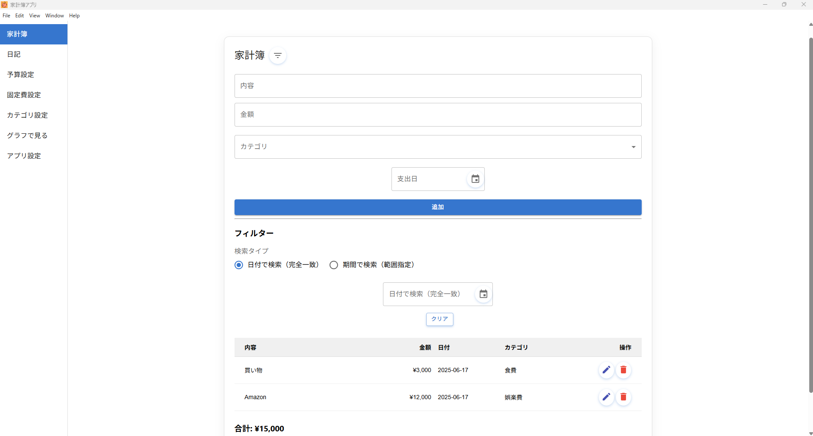
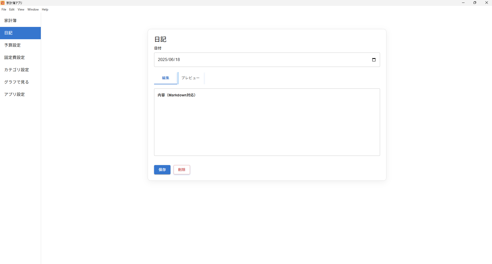
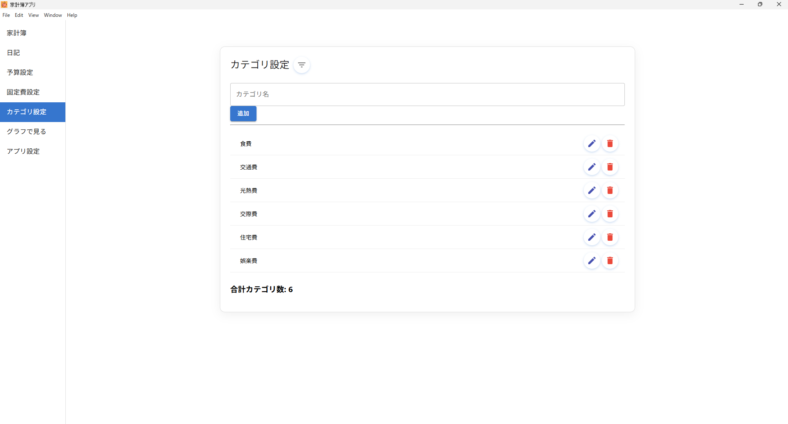
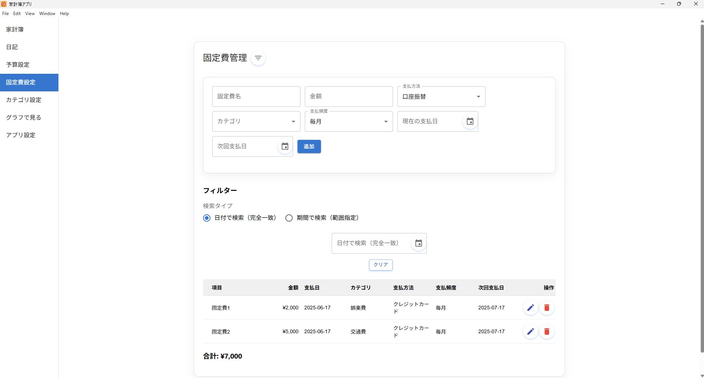
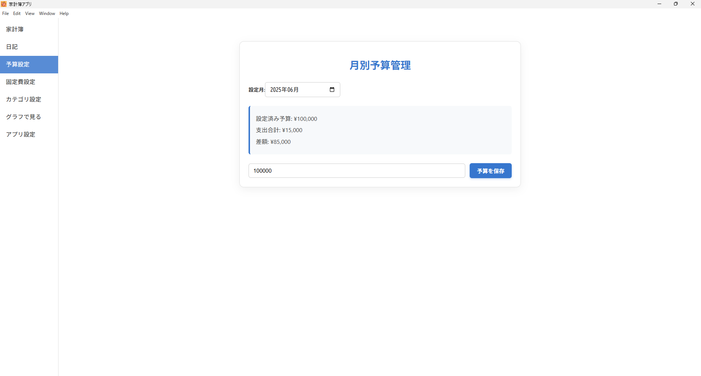
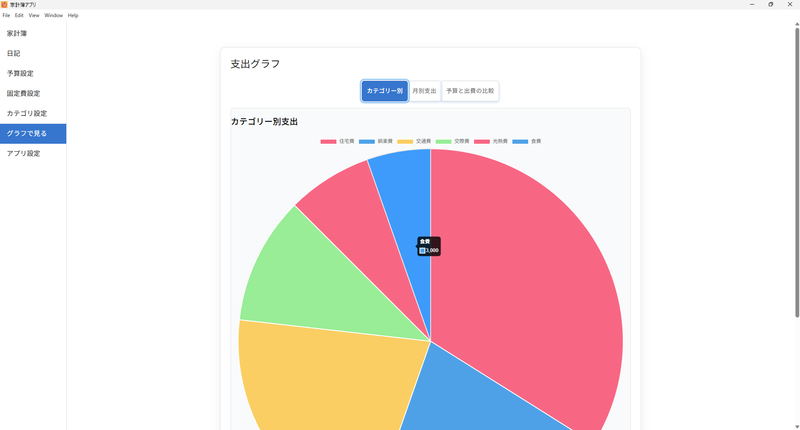

# Kakeibo App (In Development)

> Elevate your finances, ignite your future — a budgeting app like no other!  
> 収支を爆上げ！未来を変える家計簿、ここに誕生！  
> Поднимите финансы и зажгите будущее — уникальное приложение для бюджета!

---

###  Extended Intro / イントロ追加 / Расширенное вступление

**🇬🇧 English**  
Tired of managing your finances? That era is over.  
With this single app, you can track your spending, set your budget, visualize your trends, and even reflect through journaling — all in one place.  
Powered by blazing-fast Go in the backend, smart Python analysis, and a snappy UI built with modern React + TypeScript.  
Local-first. No cloud. No worries.

**🇯🇵 日本語**  
 家計管理、めんどくさい？もうそんな時代は終わりです。  
このアプリひとつで「収支の記録」「予算の把握」「グラフで可視化」「日記で気持ちの整理」――全部できる！  
しかもバックエンドには爆速の Go、分析には賢い Python、UI は最新の React + TypeScript。サクサク快適！  
PC だけで完結。クラウド不要。完全ローカル＆安心設計！

**🇷🇺 Русский**  
 Устали от сложного управления финансами? Это в прошлом.  
Это приложение объединяет всё: учёт расходов, контроль бюджета, наглядные графики и даже дневник для отражения мыслей.  
Скоростной Go на бэкенде, умный Python для анализа и современный интерфейс на React + TypeScript.  
Всё локально. Без облаков. Без стресса.

---

## 支出傾向分析 / Shopping Trend Analysis / Анализ расходов

**English**  
The app can locally analyze your browsing history to detect potential shopping-related visits (e.g., Amazon, Rakuten).  
This helps you identify hidden spending habits and manage your budget better.  
※ All analysis is performed **locally** and **never sent externally**. Your privacy is 100% respected.

**日本語**  
Amazon や楽天など、ショッピング系サイトの閲覧履歴をローカルで分析して「支出傾向」を可視化します。  
知らず知らずの出費を把握して、よりよい予算管理へ。  
※ **すべての処理はローカルで実行**され、**外部に送信されることは一切ありません**。プライバシーは完全に保護されます。

**Русский**  
Приложение может локально анализировать вашу историю просмотров, чтобы выявить посещения сайтов покупок (например, Amazon, Rakuten).  
Это помогает понять скрытые расходы и лучше управлять бюджетом.  
※ Весь анализ выполняется **локально**, **ничего не отправляется во внешние сети**. Ваша конфиденциальность полностью защищена.

---


## Screenshots / スクリーンショット / Скриншоты

### Personal Budget / 家計簿 / Личный бюджет

<p align="center">
  
</p>

### Journal / 日記 / Дневник

<p align="center">
  
</p>

### Category Management / カテゴリ設定 / Управление категориями

<p align="center">
  
</p>

### Recurring Expenses / 固定費設定 / Регулярные расходы

<p align="center">
  
</p>

### Budget Planning / 予算設定 / Планирование бюджета

<p align="center">
  
</p>

### Analytics (Graphs) / グラフで見る / Аналитика (графики)

<p align="center">
  
</p>

### App Settings / アプリ設定 / Настройки приложения

<p align="center">
  
</p>

---

## Overview / 概要 / Обзор

**Kakeibo App** is a personal budgeting application built with React, Electron, TypeScript, Node.js, Go, and SQLite.

- English: A power-packed budgeting app that grows with your lifestyle.
- 日本語: 支出管理を爆上げ！誰でも使える多機能家計簿アプリ。
- Русский: Лёгкий и мощный способ управлять своими финансами с удовольствием.

---

## Development Status / 開発状況 / Статус разработки

- Expense tracking with performance-focused input
- Recurring costs with flexible scheduling
- Multi-language journal with mood and tags
- Monthly budget goals with visual graphs
- Graph-based insights and breakdowns
- Fully configurable settings screen

Planned Features:
- CSV & PDF export/import
- Secure password login
- Optional cloud sync for backups

---

## Tech Stack / 技術構成 / Технологии

- React
- TypeScript
- Electron
- Node.js
- SQLite
- Go
- Python
- MUI
- Chart.js

---

## Installation / インストール方法 / Установка

```bash
git clone https://github.com/pon-nuki/kakeibo-app-dev.git
cd my-electron-app
npm install
npm run build
npm run start
# パッケージ化する場合
npm run package
```

---

## Directory Structure / ディレクトリ構成 / Структура проекта

```
my-electron-app/
├─ dist/
├─ public/
├─ src/
│  ├─ main/
│  ├─ renderer/
│  ├─ services/
│  ├─ pages/
│  └─ components/
├─ go-csv-exporter/
│  ├─ exporter.go
│  ├─ go.mod
│  └─ go.sum
├─ go-csv-importer/
│  ├─ importer.go
│  ├─ go.mod
│  └─ go.sum
├─ python/
│  ├─ history_analyzer.py
│  └─ shopping_history.json
├─ resources/
│  ├─ exporter.exe
│  └─ importer.exe
├─ server.js
├─ webpack.config.js
└─ package.json
```

---

## License / ライセンス / Лицензия

MIT License
