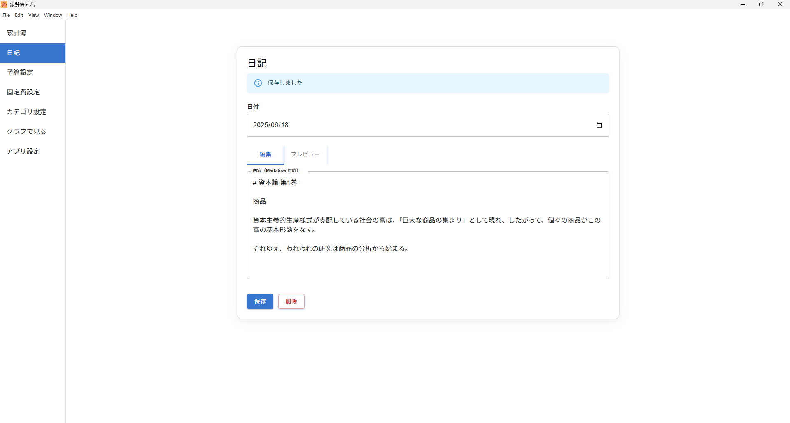

# Kakeibo App (In Development)

## 📸 Screenshots / スクリーンショット / Скриншоты

### Personal Budget / 家計簿 / Личный бюджет

  

### Journal / 日記 / Дневник

  

### Category Management / カテゴリ設定 / Управление категориями

  

### Recurring Expenses / 固定費設定 / Регулярные расходы

  

### Budget Planning / 予算設定 / Планирование бюджета

  

### Analytics (Graphs) / グラフで見る / Аналитика (графики)

  

### App Settings / アプリ設定 / Настройки приложения

  

## English

🐱 Kakeibo App  
Kakeibo is a personal budgeting app currently under development using React, Electron, TypeScript, Node.js, and SQLite.  
Our goal is to create a simple yet effective tool for managing your day-to-day finances, making it easy to track your income and expenses.

---

### Current Progress

The app is still in the early stages of development.  
Right now, we’ve implemented basic features like adding and displaying income and expenses.  
Moving forward, we plan to add:

- Data analysis tools  
- Visual reports  
- Improved UI/UX  
- More useful features

Ultimately, we want to help users keep track of their finances easily and get a clear overview of their budget.

---

### Tech Stack

- React  
- Electron  
- TypeScript  
- Node.js  
- SQLite

---

## 日本語 (Japanese)

🐱 Kakeibo App  
このプロジェクトは、React、Electron、TypeScript、Node.js、SQLiteを使用して作成中の家計簿アプリです。  
現在、アプリの基本機能を構築中で、家計の収支を簡単に管理できる機能を提供することを目指しています。

---

### 進行状況

現在、アプリの開発は途中であり、基本的な収支の入力や表示機能が実装されています。  
今後は、データの分析機能やレポート表示、ユーザーインターフェースの改善など、さらに多くの機能を追加予定です。

このアプリは、日々の支出や収入を簡単に管理し、家計の状況を把握できるようにすることを目的としています。

---

### 使用技術

- React  
- Electron  
- TypeScript  
- Node.js  
- SQLite

---

## Русский (Russian)

🐱 Kakeibo App  
Это приложение для учёта доходов и расходов, разрабатываемое с использованием технологий React, Electron, TypeScript, Node.js и SQLite.  
Мы стремимся создать удобный инструмент, который позволит легко управлять личными финансами и отслеживать состояние бюджета.

---

### Текущий статус

Разработка приложения находится на начальной стадии.  
На данный момент реализованы базовые функции — ввод и отображение записей о доходах и расходах.  
В будущем планируется добавить:

- функции анализа данных,  
- визуальные отчёты,  
- улучшенный пользовательский интерфейс,  
- и другие полезные возможности.

Цель проекта — помочь пользователям просто и эффективно управлять повседневными финансами.

---

### Используемые технологии

- React  
- Electron  
- TypeScript  
- Node.js  
- SQLite
