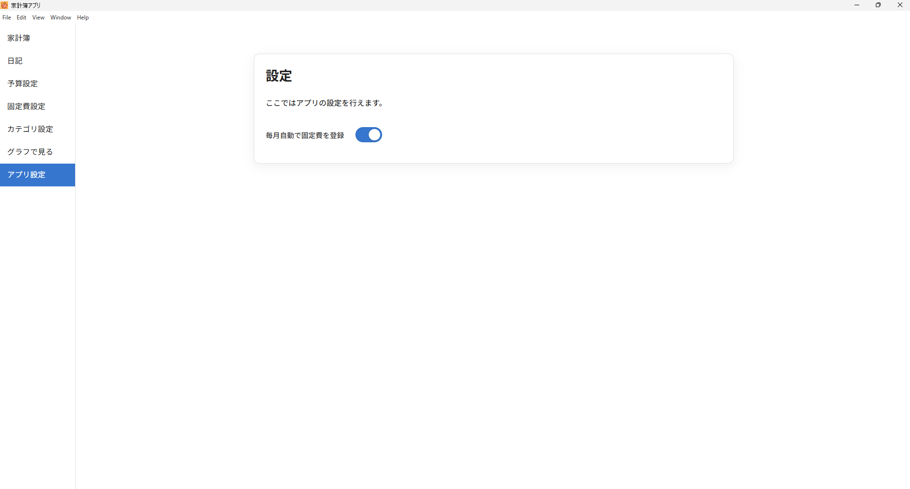

# Kakeibo App (In Development)

> Elevate your finances, ignite your future — a budgeting app like no other!  
> 収支を爆上げ！未来を変える家計簿、ここに誕生！  
> Поднимите финансы и зажгите будущее — уникальное приложение для бюджета!

## Screenshots / スクリーンショット / Скриншоты

### Personal Budget / 家計簿 / Личный бюджет

<p align="center">
  
</p>

### Journal / 日記 / Дневник

<p align="center">
  
</p>

### Category Management / カテゴリ設定 / Управление категориями

<p align="center">
  
</p>

### Recurring Expenses / 固定費設定 / Регулярные расходы

<p align="center">
  
</p>

### Budget Planning / 予算設定 / Планирование бюджета

<p align="center">
  
</p>

### Analytics (Graphs) / グラフで見る / Аналитика (графики)

<p align="center">
  
</p>

### App Settings / アプリ設定 / Настройки приложения

<p align="center">
  
</p>

---

## Overview / 概要 / Обзор

**Kakeibo App** is a personal budgeting application built with React, Electron, TypeScript, Node.js, Go, and SQLite.

- English: A power-packed budgeting app that grows with your lifestyle.
- 日本語: 支出管理を爆上げ！誰でも使える多機能家計簿アプリ。
- Русский: Лёгкий и мощный способ управлять своими финансами с удовольствием.

---

## Development Status / 開発状況 / Статус разработки

- Expense tracking with performance-focused input
- Recurring costs with flexible scheduling
- Multi-language journal with mood and tags
- Monthly budget goals with visual graphs
- Graph-based insights and breakdowns
- Fully configurable settings screen

Planned Features:
- CSV & PDF export/import
- Secure password login
- Optional cloud sync for backups

---

## Tech Stack / 技術構成 / Технологии

- React + TypeScript
- Electron
- Node.js
- SQLite
- Go
- MUI
- Chart.js

---

## Installation / インストール方法 / Установка

```bash
git clone https://github.com/pon-nuki/kakeibo-app-dev.git
cd my-electron-app
npm install
npm run build
npm run start
# パッケージ化する場合
npm run package
```

---

## Directory Structure / ディレクトリ構成 / Структура проекта

```
my-electron-app/
├─ dist/
├─ public/
├─ src/
│  ├─ main/
│  ├─ renderer/
│  ├─ services/
│  ├─ pages/
│  └─ components/
├─ go-csv-exporter/
│  ├─ exporter.go
│  ├─ go.mod
│  └─ go.sum
├─ go-csv-importer/
│  ├─ importer.go
│  ├─ go.mod
│  └─ go.sum
├─ resources/
│  ├─ exporter.exe
│  └─ importer.exe
├─ server.js
├─ webpack.config.js
└─ package.json
```

---

## License / ライセンス / Лицензия

MIT License
